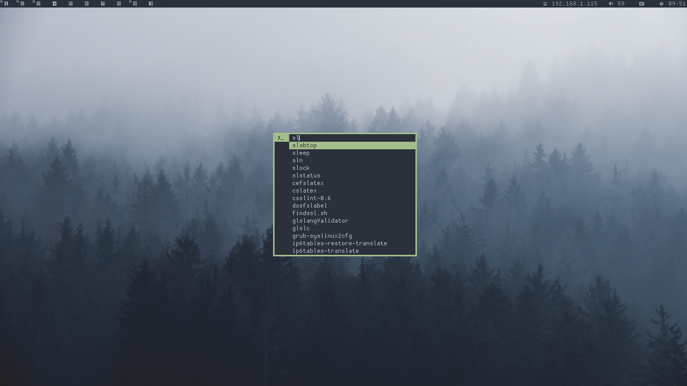
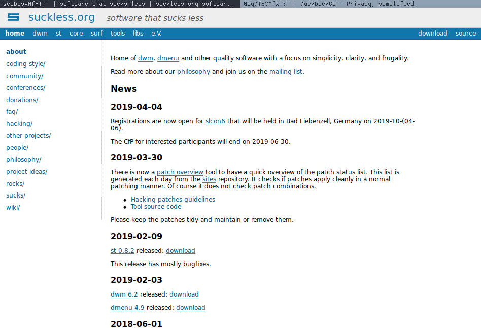
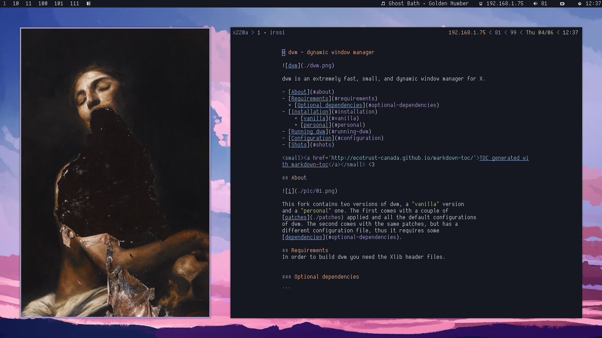

# suckless

Forks of suckless programs.

---
## st


---
## dmenu


---
## slock


---
## surf


---
## slstatus


---
## dwm - dynamic window manager


### About


This fork contains two versions of dwm, a __"vanilla"__ version
and a __"personal"__ one. The first comes with a couple of 
[patches](./patches) applied and all the default configurations
of dwm. The second comes with the same patches, but has a
different configuration file, thus it requires some
[dependencies](#optional-dependencies).

### Requirements
In order to build dwm you need the Xlib header files.


#### Optional dependencies

```
    {siji,dina,cozette}-font playerctl alsamixer alsa-utils nnn
    maim slock tabbed st dmenu
```

> You can build `slock tabbed st dmenu`, check
  [suckless](https://suckless.org) website. `siji-font` is available in
  this [repo](https://github.com/stark/siji) and `cozette`.

### Installation
Clone and edit `config.mk` to match your local setup (dwm is installed into
the `/usr/local` namespace by default).

##### vanilla

Enter the following commands to build and install dwm (if necessary as root):

```sh
rm config.h
make clean install
```

##### personal

Run the next line to build and install dwm with my personal configuration
(if necessary as root):

```sh
make && make install
```

> Check the optional [dependencies](#optional-dependencies) in order
  to have the setup functionalities.

### Running dwm

Add the following line to your `.xinitrc` to start dwm using `startx`:

```
    exec dwm
```

In order to connect dwm to a specific display, make sure that
the DISPLAY environment variable is set correctly, e.g.:

```
    DISPLAY=foo.bar:1 exec dwm
```

(This will start dwm on display :1 of the host foo.bar.)

In order to display status info in the bar, you can do something
like this in your `.xinitrc`:

```sh
    while xsetroot -name "`date` `uptime | sed 's/.*,//'`"
    do
    	sleep 1
    done &
    exec dwm
```

Or create a custom script and execute it in `.xinitrc`.


### Configuration
The configuration of dwm is done by creating a custom config.h
and (re)compiling the source code. (:

### Screenshots



